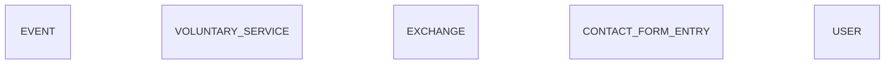

# Entity Model

## Entity Relationship Diagram

The schema contains no foreign keys and no associations: every entity stands on its own.
Events, voluntary service offers, exchange offers, contact messages and user accounts are
maintained independently of each other.

### EVENT

An international Cevi event that visitors can attend, announced on the public event list.

| Attribute   | Description                                                        | Data Type | Length/Precision | Validation Rules      |
|-------------|--------------------------------------------------------------------|-----------|------------------|-----------------------|
| id          | Unique identifier                                                  | Long      | 19               | Primary Key, Sequence |
| title       | Name of the event as shown to visitors                             | String    | 255              | Not Null              |
| slug        | Short readable name forming the public address of the event        | String    | 255              | Not Null, Unique      |
| date        | Date of the event as free text, as it should be read by visitors   | String    | 255              | Not Null              |
| location    | Place or country where the event takes place                       | String    | 255              | Not Null              |
| displayDate | Date until which the event stays in the list of upcoming events    | Date      | -                | Not Null              |
| description | Formatted description with costs, programme and further links      | String    | 65535            | Not Null              |

The event carries two dates on purpose: `date` is the human-readable period shown to visitors
("15. - 24. Oktober 2023"), while `displayDate` is the single date the system compares against
today to decide whether the event is still upcoming.

**Constraints:** `description` holds HTML that is rendered unescaped on the public pages. It is
therefore stored already reduced to the allow-list documented in
[Rich Text Allow-List](#rich-text-allow-list); the stored value, not the submitted one, is the
authority. The length limit applies after that reduction.

### VOLUNTARY_SERVICE

A voluntary service opportunity abroad that an organisation offers and that the working group recommends.

| Attribute        | Description                                             | Data Type | Length/Precision | Validation Rules |
|------------------|---------------------------------------------------------|-----------|------------------|------------------|
| id               | Unique identifier                                       | Long      | 19               | Primary Key, Sequence |
| organization     | Organisation running the voluntary service              | String    | 255              | Not Null         |
| organizationLink | Address of the organisation's own website               | String    | 255              | Not Null         |
| location         | Country or region of the assignment                     | String    | 255              | Not Null         |
| description      | Formatted description with duration and further links   | String    | 65535            | Not Null         |

The database stores these columns as unbounded text; the lengths above are the limits the
application enforces before storing, not constraints the schema declares today.

**Constraints:** `organizationLink` must start with `http://` or `https://`, so that the value can
never turn into a script-executing link once the field is rendered as a hyperlink. `description` is
subject to the same [Rich Text Allow-List](#rich-text-allow-list) as `EVENT.description`.

### EXCHANGE

An exchange opportunity with a partner organisation abroad.

| Attribute        | Description                                     | Data Type | Length/Precision | Validation Rules      |
|------------------|-------------------------------------------------|-----------|------------------|-----------------------|
| id               | Unique identifier                               | Long      | 19               | Primary Key, Sequence |
| organization     | Organisation offering the exchange              | String    | 255              | Not Null              |
| organizationLink | Address of the organisation's own website       | String    | 255              | Not Null              |
| description      | Formatted description of the exchange offer     | String    | 65535            | Not Null              |

This entity exists in the database and a display fragment for it exists in the user interface,
but no application code currently reads or writes it — there is no use case for exchange offers.
It is documented here because the schema is the authority; whether the feature should be
completed or the table dropped is a decision for the product owner.

### CONTACT_FORM_ENTRY

A message a visitor sent to the international working group through the contact form.

| Attribute | Description                                       | Data Type | Length/Precision | Validation Rules      |
|-----------|---------------------------------------------------|-----------|------------------|-----------------------|
| id        | Unique identifier                                 | Long      | 19               | Primary Key, Sequence |
| message   | Free-text message written by the visitor          | String    | 5000             | Not Null              |

The message is deliberately the only stored attribute: no sender data is requested, so a visitor
who wants a reply includes their contact details in the message text itself.

**Constraints:** the 5 000 character limit is validated before storage. It exists because the
endpoint is anonymous: without it, a single request may write up to the HTTP body limit (10 MB) into
the database file, and the file shares a filesystem with the host.

### USER

An account that may sign in and maintain the published content.

| Attribute | Description                                    | Data Type | Length/Precision | Validation Rules       |
|-----------|------------------------------------------------|-----------|------------------|------------------------|
| id        | Unique identifier                              | Long      | 19               | Primary Key, Sequence  |
| username  | Name the account signs in with                 | String    | 255              | Not Null, Unique       |
| password  | Password stored in irreversible form           | String    | 255              | Not Null               |
| role      | Role granted to the account                    | String    | 255              | Not Null, Values: admin |

The schema for this table still allows empty and duplicate user names; the rules above are the
ones the sign-in mechanism relies on and should be made explicit in the schema.

**Constraints:** `password` holds a bcrypt hash and never a readable password. The hash is treated
as a secret in its own right: no rendering, logging or `toString()` of the entity may reproduce it.

## Rich Text Allow-List

`EVENT.description` and `VOLUNTARY_SERVICE.description` are the only attributes rendered to visitors
without HTML escaping. Before either is stored, the submitted markup is reduced to this allow-list;
anything else is dropped.

| Group      | Allowed                                                                                          |
|------------|--------------------------------------------------------------------------------------------------|
| Structure  | `p`, `br`, `hr`, `div`, `span`, `blockquote`, `pre`, `h1`–`h6`                                     |
| Emphasis   | `b`, `strong`, `i`, `em`, `u`, `s`, `strike`, `sub`, `sup`, `code`, `font` (`color`, `face`, `size`) |
| Lists      | `ul`, `ol`, `li`                                                                                  |
| Tables     | `table`, `thead`, `tbody`, `tfoot`, `tr`, `th`, `td`, `caption` (`colspan`, `rowspan`)             |
| Links      | `a` with `href`, `title`, `target`                                                                |
| Images     | `img` with `src`, `alt`, `title`, `width`, `height`                                               |
| Styling    | `style` attributes, reduced to a safe set of CSS properties                                       |

**Constraints:** `a href` accepts `http`, `https` and `mailto` only. `img src` accepts `http`,
`https` and `data:image/…` — the latter because the editor embeds pasted pictures inline. Every
event handler attribute (`onclick`, `onerror`, …), `script`, `iframe`, `object`, `embed`, `form` and
every other URL scheme is removed. The reduction happens server-side: the editor's own filtering is
a convenience, not a boundary.
